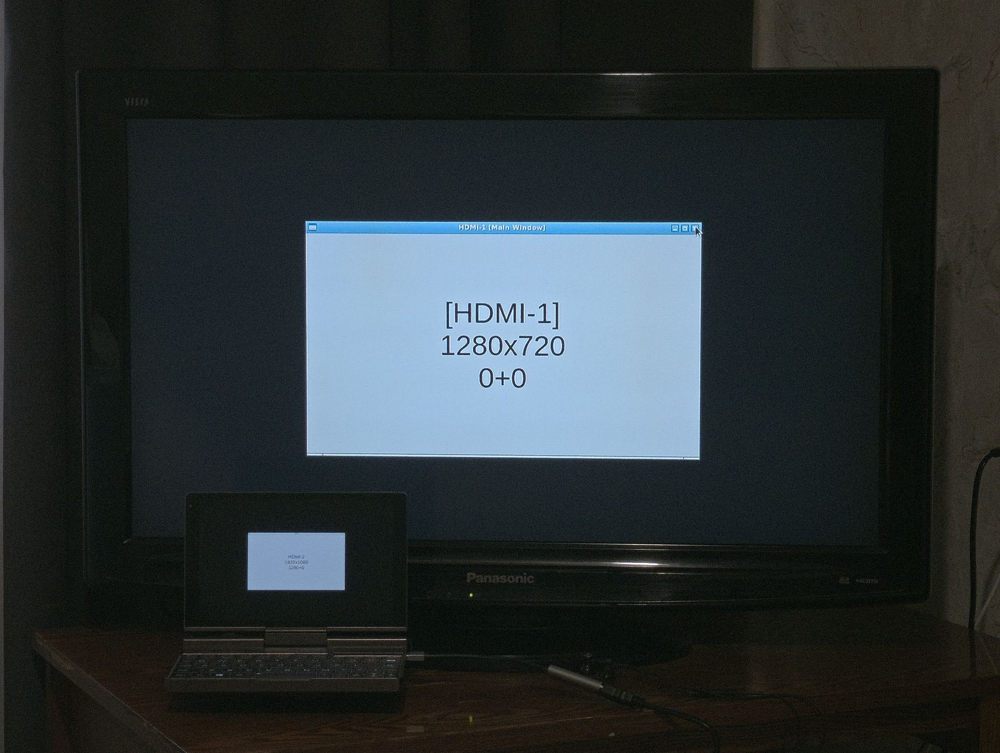

# Display Detector

This script detects connected displays using `xrandr` and creates Tkinter windows on each display.
The main window is placed on the primary display, and additional windows are created for each secondary display.
The windows are positioned near the center of their respective displays and display the name of the display.

## Requirements

- xrandr
- Python 3.11+
- Tkinter
